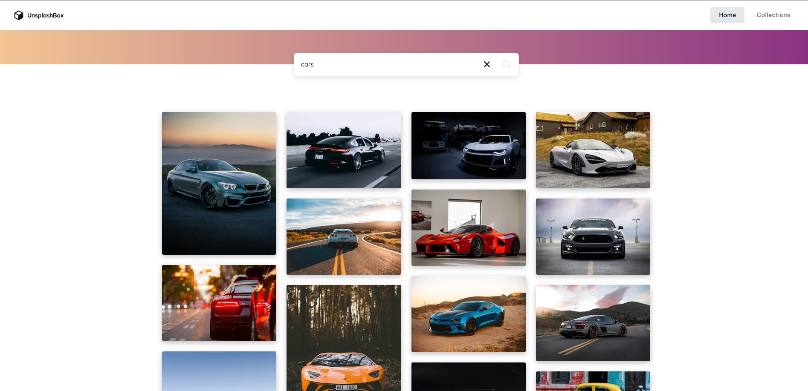

<h1 align="center">Unsplash Collection</h1>

🚀 Key Features

🔎 Unsplash photo search — users can search photos through the Unsplash API.

🖼️ Responsive masonry grid — images are displayed in adaptive columns with lazy loading.

📸 Photo details — each image has its own page with author, date, description, and download action.

📥 Download tracking — photo downloads use Unsplash `download_location` tracking.

🗂️ Collections — users can browse collections and open collection pages.

➕ Save to collections — photos can be added to or removed from custom collections.

⚡ Infinite pagination cache — search results and collection images can restore list state after navigation.

🌫️ Blurhash placeholders — image cards show decoded blurhash previews while photos are loading.

## Table of Contents

- [Overview](#overview)
- [Built with](#built-with)
- [Contact](#contact)

## Overview

### Built with

- Next.js
- React
- TypeScript
- SCSS Modules
- Radix UI (Dialog)
- Unsplash API
- PostgreSQL
- FSD
- Eslint, Stylelint, Prettier

## Author

- Website [Unsplash Collection](https://unsplash-collection-eta.vercel.app)
- GitHub [NakhimoVV](https://github.com/NakhimoVV)
